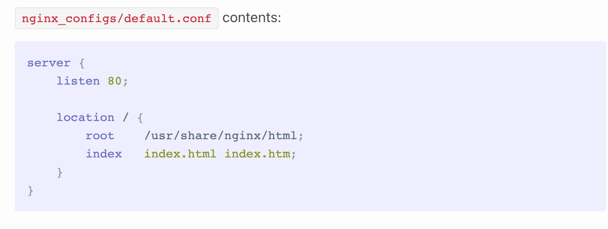

# Reverse proxy nginx docker


## Description
Un proxy inverse intercepte les requêtes entrantes et les dirige vers le serveur approprié. 
Non seulement cela accélère les performances, mais cela renforce également la sécurité du serveur.

Le moyen le plus simple de configurer et de gérer des proxys inverses consiste à utiliser Nginx et Docker. 
Ce guide configure deux exemples de services Web dans des conteneurs Docker et un proxy inverse Nginx pour ces services.

## Prerequis
- Docker
- Docker-compose

## Etape 1:
- Créer un fichier docker-compose.yml à la racine du projet
- Créer un dossier avec le premier service ou premiere application
- Créer un dossier proxy avec un sous dossier includes, ssl , un fichier notfound.html et un fichier nginx.conf


## Etape 2:

Créer les services dans le fichier docker-compose.yml.
seul le service nginx principal sera ouvert au public sur les port 80 et 443.
---


---


---


___


## Etape 3:

```bash
#commnt generer un certificat ssl
sudo openssl req -x509 -nodes -days 365 -newkey rsa:2048 -keyout example1.key -out example1.crt
```

## Mes sources
- [MDN doc sur conf nginx](https://ssl-config.mozilla.org/#server=nginx&version=1.17.7&config=intermediate&openssl=1.1.1k&guideline=5.7)
- [phoenixnap tuto sur proxy reverse](https://phoenixnap.com/kb/docker-nginx-reverse-proxy)
- [mikolaj-kaminski tuto sur proxy reverse](https://mikolaj-kaminski.com/nginx-as-reverse-proxy-with-docker/)
- [medium  explication reverse proxy avec traefik](https://blog.ouidou.fr/%C3%A0-la-d%C3%A9couverte-de-traefik-18da29cdbb46)
