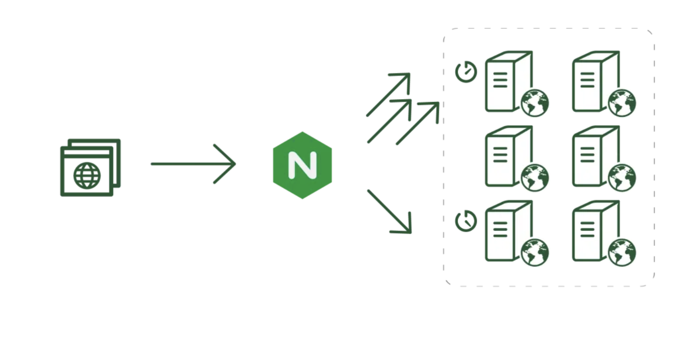

# Simple Load balancing avec nginx et 3 app web

## Description

Un équilibreur de charge est un matériel/logiciel qui agit comme un proxy inverse et distribue le trafic réseau ou applicatif sur un certain nombre de serveurs. 
Les équilibreurs de charge sont utilisés pour augmenter la capacité (utilisateurs simultanés) et la fiabilité des applications. 
Ils améliorent les performances globales des applications en réduisant la charge sur les serveurs associée à la gestion et à la maintenance des sessions d'application et de réseau.

## Prérequis
- [x] 3 VMs (1 nginx, 2 app web)
- [x] Docker
- [x] Docker-compose

